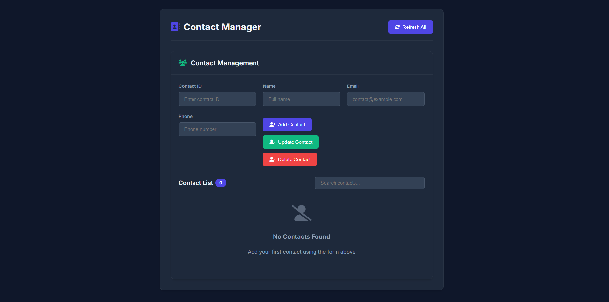

# Contact Management System



A modern, browser-based Contact Management System built with TypeScript, HTML, and CSS.  
Users can add, update, delete, search, and list contacts. All data is stored in the browser's localStorage.

---

## Features

- **Add Contact:** Enter contact ID, name, email, and phone to add a new contact.
- **Update Contact:** Update an existing contact's details by entering their ID and new info.
- **Delete Contact:** Remove a contact by entering their ID.
- **Search Contacts:** Instantly filter contacts by name, email, phone, or ID.
- **Refresh:** Clear the search and form fields, and reload the contact list.
- **Persistent Storage:** All contacts are saved in localStorage and persist across browser sessions.
- **Responsive UI:** Clean, modern, and mobile-friendly interface.

---

## Project Structure

```
contact-management-system/
├── dist/
│   └── index.js         # Compiled JavaScript from TypeScript
├── src/
│   └── index.ts         # Main TypeScript source code
├── index.html           # Main HTML file
├── styles.css           # Main CSS file
├── package.json         # Project dependencies and scripts
└── tsconfig.json        # TypeScript configuration
```

---

## How to Run

1. **Install dependencies**

   ```
   npm install
   ```

2. **Compile TypeScript**

   ```
   npx tsc
   ```

   This generates `dist/index.js`.

3. **Open the app**
   - Open `index.html` in your web browser.
   - Or, for best results, run a local server (e.g. `python -m http.server`) and visit `http://localhost:8000`.

---

## Usage

- **Add a Contact:** Fill in all fields and click "Add Contact".
- **Update a Contact:** Enter the contact's ID and new info, then click "Update Contact".
- **Delete a Contact:** Enter the contact's ID and click "Delete Contact".
- **Search:** Type in the search box to filter contacts.
- **Refresh:** Click "Refresh All" to clear search and reload all contacts.

---

## Technologies Used

- **TypeScript** for application logic
- **HTML5** for structure
- **CSS3** for modern, glassmorphism-inspired design
- **localStorage** for persistent data

---

## Customization

- **Styling:** Edit `styles.css` to change the look and feel.
- **Fields:** Add or remove fields in the HTML and TypeScript as needed.
- **Validation:** Add more robust validation in `index.ts` if required.

---

## License

This project is open source and free to use.
